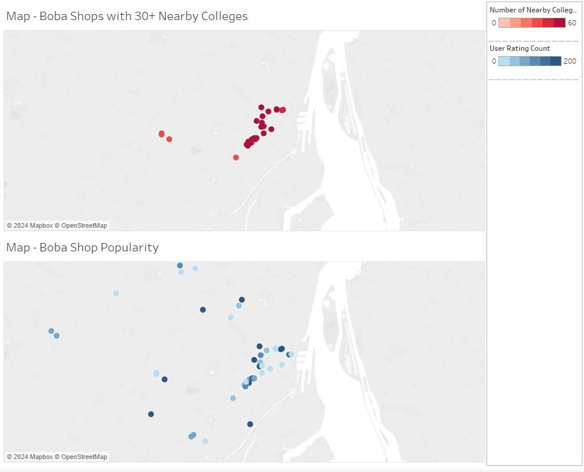
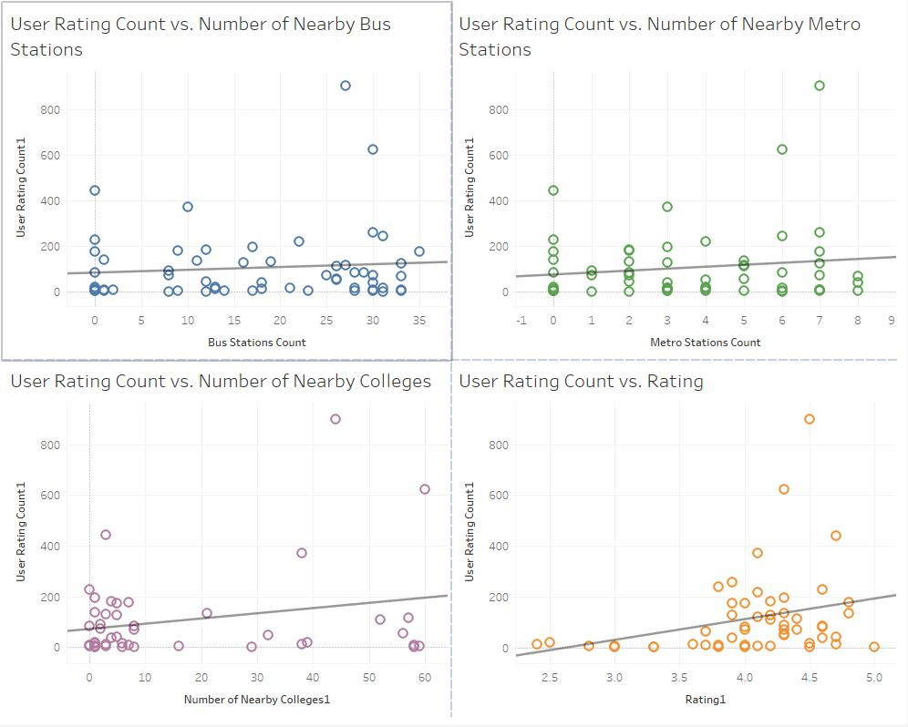

# LHL_MidtermProject

## Project Overview

The essence of our project is to delve into the evolving landscape of bubble tea shop popularity in Montreal, Canada. This analysis aims to unearth patterns and trends that influence consumer preferences and shop success, providing valuable insights into the urban culinary map and youth culture.

## Process

Variable Identification: We began by pinpointing key factors that might influence a bubble tea shop's popularity. These included proximity to educational institutions and public transport accessibility.

Data Preparation: We rigorously cleaned and filtered our dataset to ensure accuracy and relevance.

Data Collection: Utilizing Google Places API and other sources, we gathered comprehensive data on bubble tea shops in Montreal.

Model Analysis: We employed regression models to analyze the impact of our chosen variables on the shops' popularity.

Visualization and Interpretation: The data was then translated into intuitive visualizations, aiding in a clearer understanding of our findings.

## Results

Our primary metric for gauging popularity was the total number of reviews. Surprisingly, our regression analysis revealed a minimal correlation between our chosen independent variables (proximity to educational institutions and transportation facilities) and the popularity of bubble tea shops. This outcome suggests other underlying factors driving popularity that warrant further investigation.

## Visual Representation

## Challenges

Collaborative Development: Mastering GitHub for effective team collaboration presented a learning curve.

API Limitations: Overcoming the Google Places API's result limitation was a technical hurdle, ingeniously bypassed by implementing strategic time-function use, expanding our result limit to 60 entries.

## Future Goals

Given more time and resources, our future endeavors would include:

Analyzing additional variables like shop ambiance, menu diversity, and pricing.

Conducting district-specific studies within Montreal and comparative analyses across different cities.
